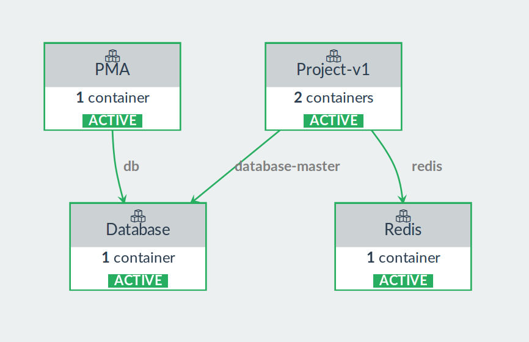
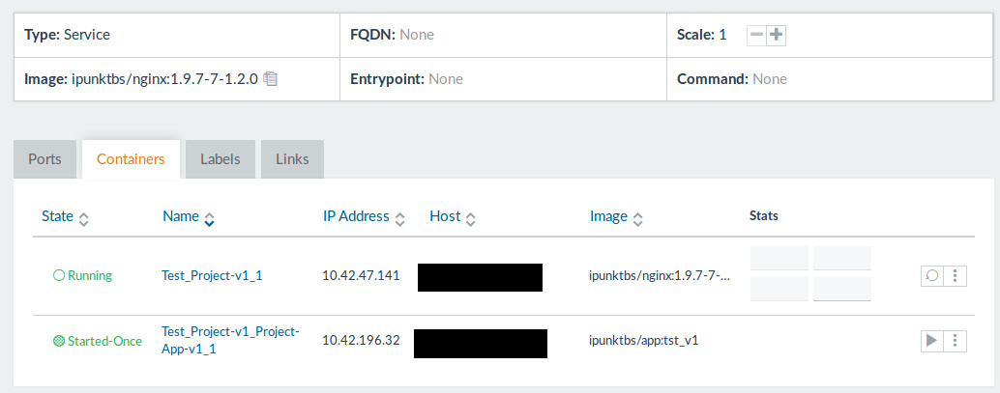

## WebserverBlueprint

This blueprint creates infrastructures to support apps using php7.

### Typical Infrastructure

### Recognized Configuration Values
- [Healthcheck Options](../Healthcheck/README.md)
- [Scheduler Options](../Scheduler/README.md)
- [Publish Urls Options](../PublishUrls/README.md)
- [External Service Options](../ExternalService/README.md)
- [Cron Options](../Cron/README.md)
- [PHP Options](../Infrastructure/Service/Maker/PhpFpm/README.md)
- [Volumes](../Volumes/README.md)

#### Docker options
| Option | Defaults to | Explanation |
| ------- |:-----------:| ------------ |
|`docker.base-image`| REQUIRED | Docker-Image to base the created app-image on. |
|`rancher.in-service`| false | Activates in-service upgrades instead of rolling upgrades between services. !DEPRECATED! use `rancher.upgrade-mode` |
|`rancher.upgrade-mode`| `rolling-upgrade` | Change upgrade mode between rolling upgrade, in-service upgrade and `replace` which deletes the service and CREATEs it again. Possible values: `rolling-upgrade`, `in-service`, `replace` |
|`rancher.create-mode`| `start` | Possible values: `start`, `create` |
|`service-name`| REQUIRED | The name of the created main service, will have the version appended to it in rancher |
|`use-app-container`| true | If set to false no service will be created to mount the app using a docker image |
|`mount-workdir`| false | If set to true then the project root will be mounted into the main app nginx. !Does not work when deploying into rancher! |
|`external_links` | [] | Any property set in this object will be added as external link using the name of the property. e.g. `"host": "stackname/servicename"` will make any network traffic to `host` go to a container from `stackname/servicename` |
|`docker.persistent-driver`| pxd | Driver to use for volumes given as `persistent-volumes` |
|`docker.persistent-options`| ['repl'=>3, 'shared' => 'on'] | Driveroptions to use for volumes given as `persistent-volumes` |
|`persistent-volumes`| [] | "volumeName": "/internal/path" for named volumes to be used with `docker.persistent-driver` as storage driver |

#### Usage options
| Option | Defaults to | Explanation |
| ------- |:-----------:| ------------ |
|`sync-user-into-container`| false  | If set rancherize will set USER_ID and GROUP_ID of the container to the environment vars `USER_ID` and `GROUP_ID`. Fallback are your current uid/gid. Default images react to this by creating a user with it and running under this user. |
|`debug-image`| false  | Use the debug version of the default build instead - !overwrites docker.image if set to true! |
|`nginx-config`|  | If set to the path of a file relative to the app work directory then the file will be used by the main app nginx. This file gets included, so you have to configure only the `server` configuration for nginx. |
|`environment` | [] | Any property set in this object will be passed to the running container as shell environment variable `PROPERTNAME=PROPERTYVALUE`. Note that environment values set in the `defaults` can be overwritten but not un-set |
|`expose-port`|  | if set then the Port 80 of the nginx container will be exposed to this host port |
|`add-version`|  | The value given here will be used as name for an environment variable which is set to the version that is being built. |
|`work-sub-directory` | '' | Appended to `.` / `getcwd()` as source directory for mounting / copying to the image |
|`target-sub-directory` | '' | Appended to `/var/www/app` as target directory for mounting / copying to the image |
|`extra-files` | [] | A list of pathes relative to the project root. All files will be added to /opt/custom/ |
|`nginx.enable` | true | Can be set to `false` to disable adding the config snippets without removing their configuration  |
|`nginx.snippets` | [] | List of files relative to the project root to be added to /etc/nginx/server.d. File ending with `.conf` will be included by the default nginx server config |

#### Additional services

| Option | Defaults to | Explanation |
| ------- |:-----------:| ------------ |
|`php`| `7.0` | Legacy version of php.version |
|`php.version`| `7.0` | Add php fpm to the nginx. The default version `7.0` does not start an extra service. Other fpm versions are run in their own container and will be a sidekick inside the nginx service. Available Versions: `7.0`, `5.3` |
|`php.memory-limit`| `1024M` | |
|`php.post-limit`| `8M` | PHP memory limit option |
|`php.upload-file-limit`| `2M` | PHP post_max_size option |
|`php.default-timezone`| `UTC` | PHP date.timezone option |
|`queues`| [] | Add Laravel Queue Worker, providing their name and connection in `name` and `connection`. Example: `"queues":[{"connection": "redis","name": "default"}],` |
|`queue-image-version`| `php7.0-v1.0` | Which docker image version do you need: (default: `php7.0-v1.0`; also `php7.1-v2.0`, `php7.2-v3.0` and `latest` are [valid](https://hub.docker.com/r/ipunktbs/laravel-queue-worker/tags/) right now) |
|`add-redis`| false | Add a Redis server and link it to the main app, providing its name and port in `REDIS_HOST` and `REDIS_PORT` |

#### Services for local development

| Option | Defaults to | Explanation |
| ------- |:-----------:| ------------ |
|`add-database`| false | If set to true then a database server will be started as part of the stack and linked to the main app. Database name, user and password can be found in `DATABASE_NAME`, `DATABASE_USER` and `DATABASE_PORT` |
|`database.name`| db | Sets the name of the default database created by the database container |
|`database.user`| user | Sets the name of the default user created by the database container |
|`database.password`| pw | Sets the default password created by the database container |
|`database.init-dumps`| [] | A list of local .sql files, relative to the project root from which rancherize is called, that will be mounted into the database container as volumes and imported on the first start. |
|`database.pma` OR `database.pma.enable`| true | !Only effective if add-database is true! If set to true then a phpmyadmin container is started and connected to the database container |
|`database.pma.require-login`| false | !Only effective if database.pma is true! `true` requires login to pma. `false` logs pma into the database with the database user and password.|
|`database.pma-expose` OR `database.pma.expose`| true | Can be set to false to prevent exposing the internal pma port 80 to a host port. |
|`database.pma-port` OR `database.pma.port`| 8082 | Host port to expose the pma container port 80 to. |
